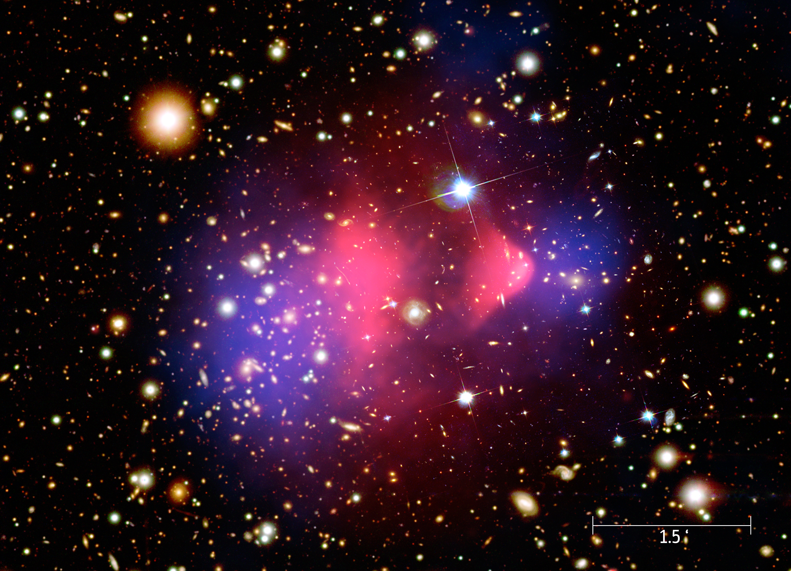

Dark Matter{#ch:dark-matter}
===================================

In this section we will be looking at dark matter (or not... because it doesn't interact with light...)

Recall from the density parameter $\Omega$ from Sec. \@ref(sec:density-cosmo). We want to find two things:

1. The value of $\Omega_m$ - the total density of matter in the Universe
2. What makes up $\Omega_m$? How much is regular matter and how much is dark matter.

We know that the critical density is 
\begin{equation}
\rho_c = 1.88 h^2 \times 10^{-26} \text{ kg m}^{-3}
(\#eq:crit-den-dm)
\end{equation}
which works out to approximately 1 galaxy per Mpc$^{-3}$. But just how close is the Universe's density to $\rho_c$?

## Look at the stars... {#sec:look-stars}
We can get a first estimate just by looking at the stars. Stellar evolution theory tells us how luminosity and temperature (hence magnitudes and colours) are related to a star's mass. We can measure lots of stars, add up in the mass in stars over a large region of sky to estimate the density of material contained in stars.

\begin{equation}
\Omega_{\text{stars}} = \dfrac{\rho_{\text{stars}}}{\rho_c} \approx 0.005 \text{ to } 0.01
	(\#eq:rho-stars)
\end{equation}

What's interesting here is that $\Omega_{\text{stars}}$ is independent of $h$. All we're doing in this calculation is adding up the flux ($F$) that we see. We know that flux decreases as $F \propto \dfrac{1}{d^2}$, and that $d \propto h$, which cancels out the $h^2$ in Eq. \@ref(eq:crit-den-dm).

This sounds like an ideal way to measure $\Omega_m$, but it has it's problems. Some stars are too faint to be measured. This could be because they're too far away, or because they're too low mass (hence intrinsically faint) to be detected. 

```{r echo=FALSE, imf, out.width='100%', fig.show='hold', fig.cap="Illustration of the stellar initial mass function, showing the number distribution of stars as a function of mass. Low mass stars are far more numerous than high mass stars. Figure from @imf-paper"}
knitr::include_graphics("Images/imf.jpg")
```

Figure \@ref(fig:imf) shows an illustration of the stellar initial mass function -- the number of stars as a function of initial mass. Fig. \@ref(fig:imf) shows that low mass stars vastly outnumber high mass stars. This means that if we are missing faint, low mass stars in the our estimation in Eq. \@ref(eq:rho-stars), we'll be missing a significant fraction of the Universe's mass.

Even if we could measure all the stars, we'd still be missing a lot of mass. As the terrible illustration in Fig. \@ref(fig:shit-galaxy) shows, not all luminous material is contained in stars. Matter is also contained in things like gas and dust. 

```{r echo=FALSE, shit-galaxy, out.width='100%', fig.show='hold', fig.cap="A (very poor) schematic of a galaxy"}

```

If we only consider the mass of stars that we can observe in Fig. \@ref(eq:rho-stars) we'll be missing these components too.

So just looking at the stars isn't going to cut it. We need something else. 

## Nucleosynthesis {#sec:nucleosynthesis}

Nucleosynthesis is the process that formed the light elements, Hydrogen, Deuterium, Helium and Lithium. We can compare the observed abundances of these elements with those predicted by cosmological models to work out the density of baryonic matter, $\Omega_b$. Observations constrain $\Omega_b$ to
\begin{equation}
0.021 \leq \Omega_b h^2 \leq 0.025.
(\#eq:nucleo)
\end{equation}

$\Omega_b$ contains all baryonic matter, and is much higher than we estimated for $\Omega_{\text{stars}}$. While we know that $\Omega_{\text{stars}}$ is missing *some* mass by missing low mass stars etc, this doesn't account for the whole discrepancy. There must be some **missing** baryonic matter that we can't see.

## Galaxy rotation curves {#sec:rotation-curves}

Some of the first observational evidence for the existence of dark matter came from **galaxy rotation curves**. If we assume that Kepler's law holds (always a good assumption), then the rotation velocity, $v$, is given by
\begin{equation}
v = \sqrt{\dfrac{G M(R)}{R}}
(\#eq:kepler)
\end{equation}
where $M(R)$ is the mass interior to the radius $R$. Mass outside this radius doesn't contribute.

The green line in Figure \@ref(fig:rotation-curve) shows the expected rotation curve for a typical spiral galaxy if we calculate the $M(R)$ from looking at the stars, dust and gas. The black lines show the observed rotation curve with $v$ becoming constant at large radii. Beyond the visible disk radius $v$ is up to three times higher than predicted using the visible mass alone. 

```{r echo=FALSE, rotation-curve, out.width='100%', fig.show='hold', fig.cap="Schematic of a typical spiral galaxy rotation curve. The green line shows the expected rotation velocity as a function of radius, with droping off as $v \\propto 1/\\sqrt{r}$ outside the visible disk (dashed line) and bulge (dot-dash line). However, observations show that rotation curves plateau (red line), indicating the presence of mass beyond the visible disk. This \"missing mass\" is attributed to the dark matter halo (dotted line). Adapted from [MilkyWay@Home](https://milkyway.cs.rpi.edu/milkyway/science.php)"}

```

Similar to the result in \@ref(sec:nucleosynthesis), the observations show that there must be some missing mass that we need to account for. There must be some kind of **dark matter halo** enclosing the galaxies to keep the rotation velocity constant at large $R$. The density contribution from dark matter halos is approximately 
\begin{equation}
\Omega_{\text{halo}} \approx 0.1,
(\#eq:dm-halo)
\end{equation}
an order of magnitude higher than $\Omega_{\text{stars}}$. But it doesn't tell us anything about what the dark matter halo is made of. It could be baryonic matter in the form of low mass stars or brown dwarfs or something we haven't thought of. Or perhaps it's something non-baryonic?

## Galaxy clusters {#sec:gal-clusters}

The final place we will look today in our investigation of dark matter is galaxy clusters. Galaxy clusters are the largest gravitationally collapsed objects in the Universe. Therefore they should contain a representative sample of material and are an ideal location for us to search for dark matter.

Galaxy clusters contain galaxies comprised of stars, dust and gas, and they also contain diffuse, hot X-ray gas. There is around 5 to 10 times more hot gas than stars in galaxy clusters - hence there are much more baryons. 

Hot gas in the cluster is confined to the cluster by gravity, so if we look at the distribution of the X-ray gas we can work out the distribution of the gravitational potential. Perhaps the most well known analysis of this kind was performed on the Bullet cluster. 

Figure \@ref(fig:bullet) shows a composite image of the Bullet cluster, with the hot gas represented in pink and the mass distribution represented in blue. 

```{r echo=FALSE, bullet, out.width='100%', fig.show='hold', fig.cap="Composite image of the Bullet Cluster. Background image: Magellan and *Hubble* visible images. Pink: hot x-ray gas observed by *Chandra*. Blue shows the mass distribution of the clusters calculated from gravitational lens effects. Credit: NASA/CXC/M. Weiss - Chandra X-Ray Observatory: 1E 0657-56."}

```

The calculated mass of the cluster is approximately 10 times higher than the mass of the hot gas (which in turn is 10 times higher than the mass in stars). Using these observations we find
\begin{equation}
\dfrac{\Omega_{b}}{\Omega_m} \approx 0.065 h^{-3/2}.
(\#eq:dm-gal-clusters)
\end{equation}

If we combine this with the $\Omega_b$ found from nucleosynthesis we find
\begin{equation}
\Omega_{m} \approx 0.035 h^{-1/2}.
(\#eq:omega-dm-gal-clusters)
\end{equation}

This is **much higher** than our other estimates. It tells us that a large proportion of the matter in the Universe is not normal, baryonic matter, but is **dark matter**.

## What could it be? {#sec:what-could-it-be}

We now have lots of evidence that non-baryonic dark matter exists. However, we are yet to directly detect it. There are many possibilities for the nature of dark matter, including different types of fundamental particles and compact objects.

### Fundamental particles {#sec:fund-dm}

Several of the candidates for dark matter are fundamental particles: 

 - Neutrinos:

We still don't know a lot about neutrinos, which makes them a good place to start in our search for for dark matter. Regular neutrinos (with very small masses) move at relativistic speeds. Dark matter made of relativistic particles is known as "hot" dark matter. However, these hot neutrinos can't account for all of the mass density attributed to dark matter. They also don't work well with current theories of structure formation, so we can rule them out for now. (We will come to how dark matter fits into structure formation later in the course.)
 
 One alternative is "heavy" neutrinos, with masses comparable to the mass of a proton. These neutrinos would be considered "cold" dark matter as they don't move at relativistic speeds. Heavy neutrinos *would* work for structure formation, but they wouldn't fit well into the standard model of particle physics. 
 
 - Supersymmetric particles:

Supersymmetry associates companion particles with currently known particles. **WIMPS** are weakly interacting massive particles, such as the photino, gravitino and the neutralino. Neutralinos are the most likely dark matter candidate of the supersymmetric particles as they would be a stable, cold dark matter candidate and would work for structure formation.

- Other weird things:

Aside from neutrinos and WIMPs, dark matter could be composed of other weird particles such as the super-light axion particle, or ultra-heavy particles formed at the end of inflation. Particles from a "shadow universe" have even been proposed as a dark matter candidate. Of course, it could be some type of particle we haven't dreamed up yet.

### Compact objects {#sec:compact-dm}

The other option is that dark matter is comprised of compact objects, such as black holes or **MACHOs**.
 
 - Black holes:

It's possible that dark matter is made up of primordial black holes that formed in the very early universe. They must have formed before nucleosynthesis, as baryons that were already in black holes *before* nucleosynthesis takes place are not counted as baryons in our models.

- MACHOs:

MACHOs (massive compact halo objects) are compact objects with masses of the order of a solar mass. They could be made of baryonic matter - for example brown dwarf stars. They could also be made of non-baryonic matter. 

## Searching for dark matter {#sec:searching-dm}

How do you look for something you can't see? Searches for MACHOs are done using microlensing surveys, such as the [MACHO project](https://en.wikipedia.org/wiki/MACHO_Project) and [OGLE surveys](http://ogle.astrouw.edu.pl/). These surveys take many repeated measurements of stars in the Milky Way and nearby galaxies, looking for the small changes in brightness due to a MACHO moving in and out of the line of sight between an object and an observer and gravitationally lensing the light. 

If dark matter is non-baryonic and only interacts via gravity then direct detection may be near impossible. While there have been huge advances in gravitational wave detection in the past decade, the signals produced by dark matter particles would be minuscule. Rather than looking for the gravitational wave signal from merging black holes, they would have to detect the signal from the interactions of subatomic particles. 

However, if non-baryonic dark matter interacts via gravity **and** the weak nuclear force then it's possible that it could be detected. While such interactions of supersymmetric particles with protons or neutrons would be rare, they could (in theory) be detected. Experiments such as the LUX (the Large Underground Xenon experiment) and XENON experiments use large underground vats of liquid xenon, with photomultiplier detectors searching for the light produced by scintillation of the xenon particles by WIMPs. However, these experiments are yet to produce any positive results. 

## Summary {#sec:dm-summary}
- Luminous, baryonic matter accounts for less than 1% of the total density of the universe.
- Dark baryonic matter (e.g. cool gas) accounts for approximately 4% of the total density.
- There is around 5 times more non-baryonic dark matter than baryonic matter.
- WIMPs, MACHOs and primordial black holes are all possible candidates for dark matter.
- Direct detection of dark matter is extremely difficult (if not impossible.)
