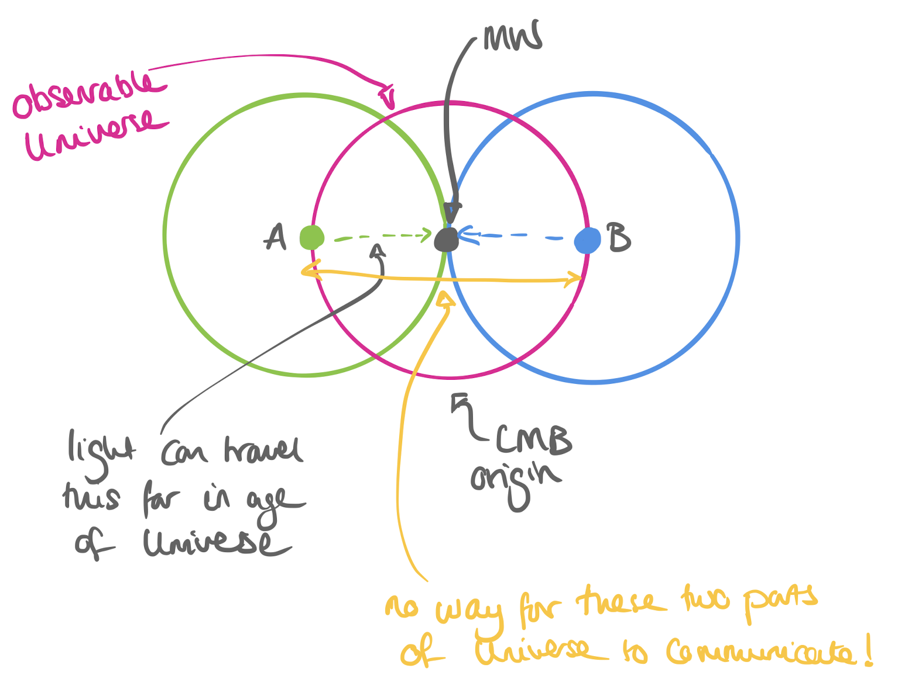

Inflation {#ch:inflation}
===================================

 <!-- TBD  -->
In the very earliest fractions of a second the universe underwent a period of rapid expansion known as **inflation**. During this time the universe expanded exponentially. In this section we'll be looking at what inflation is, why it's a necessary part of the cosmological model, and what evidence we have for it.

Why do we need inflation? {#sec:why-inflation}
-------------------

Inflation is quite a strange concept, but it's necessary to explain some of our key observations about the universe. Without it, the big bang model alone can't explain what we see. The two big problems that arise from the big bang without inflation are
* the **flatness** problem
* the **horizon** problem

The flatness problem {#sec:flatness-prob}
--------
We saw in earlier sections that the universe is very close to being a critical density universe, i.e.

\begin{equation}
\Omega_{\text{tot}} = \Omega_0 + \Omega_{\Lambda} \approx 1
(\#eq:flat-1)
\end{equation}

This means that the universe has very close to flat (Euclidian) geometry.

Further, the Friedman equation 
\begin{equation}
\lvert\Omega_{\text{tot}}(t) - 1\rvert = \dfrac{\lvert k \rvert}{a^2 H^2}
(\#eq:flat-2)
\end{equation}

tells us that if $\Omega_{\text{tot}}=1$ then it will always be equal to 1. But what about if $\Omega_{\text{tot}}\neq1$?

In a radiation dominated universe $a^2 H^2 \propto t^{-1}$ and in a matter dominated universe  $a^2 H^2 \propto t^{-2/3}$. Substituting this into Eq. \@ref(eq:flat-2) tells us that

\begin{equation}
\lvert\Omega_{\text{tot}}(t) - 1\rvert \propto t
(\#eq:flat-3)
\end{equation}
for a radiation dominated universe and 
\begin{equation}
\lvert\Omega_{\text{tot}}(t) - 1\rvert \propto t^{2/3}
(\#eq:flat-4)
\end{equation}
for a matter dominated universe. This means that $\Omega_{\text{tot}}$ moves further away from 1 over time; **flat geometry is unstable** and the universe becomes more curved over time. As our observations show that $\Omega_{\text{tot}} \approx 1$ now, meaning that it must have been even closer to 1 in the very early universe.

We can also see the flatness problem by considering the scale factor dependence of the energy density:
\begin{align}
\rho_{\text{rad}} \propto a^{-4}, &\qquad \rho_{\text{mat}} \propto a^{-3}
(\#eq:flat-5)
\end{align}
which decreases more quickly with time than the $k/a^2$ term in the Friedman equation. This means that if the curvature term doesn't dominate the evolution now, it must have made an even smaller contribution in the early universe (*note:* this is valid only for a **flat** universe, not when the cosmological constant dominates, or in a non-flat universe.)

But just how close was the universe to  $\Omega_{\text{tot}} \approx 1$ at early times?

* Decoupling (t = 10$^{13}$ s): $\lvert\Omega_{\text{tot}} - 1\rvert \leq 10^{-5}$
* Matter-radiation equality (t = 10$^{12}$ s): $\lvert\Omega_{\text{tot}} - 1\rvert \leq 10^{-6}$
* Nucleosynthesis: (t = 1 s): $\lvert\Omega_{\text{tot}} - 1\rvert \leq 10^{-18}$
* Electroweak symmetry breaking: (t = 10$^{-12}$ s): $\lvert\Omega_{\text{tot}} - 1\rvert \leq 10^{-30}$

The obvious solution is to set $\Omega_{\text{tot}} = 1$. But why should it be? There's no reason that it **should** be exactly flat. But it would fit with our observations...

The horizon problem {#sec:horizon-prob}
-----

```{r echo=FALSE, horizon-problem, out.width='80%', fig.show='hold', fig.cap="The horizon problem. The pink circle has the MW galaxy at the center and has a radius equal to the distance light can travel in the age of the Universe. An event at A can only influence things inside the green circle, and an event at B can only influence things inside the blue circle. So if the points at A and B aren't causally connected, how can the CMB be the same temperature everywhere on the sky?"}

```
Figure \@ref(fig:horizon-problem) illustrates the horizon problem. Light travels at a finite speed, so there is a finite distance it can have travelled since the big bang. This means that two points in opposite directions on the sky (A and B in the figure) are not causally connected - light simply cannot have travelled that far. But we observe the CMB to be at the same temperature in all directions... 

But it gets worse. CMB photons have only been free to explore the universe since decoupling. For them all to be at the same temperature now they would have had to reach thermal equlibrium before that point, when the observable universe was even smaller than it is now. And as a last kick in the teeth, the big bang alone can't explain the tiny fluctuations that we do see in the CMB temperature. There's definately something else going on.

Inflationary expansion {#sec:inflation-expansion}
----
Inflation was first proposed by Alan Guth in 1981. He proposed that there was a period of time where the scale factor was accelerating:
\begin{equation}
\ddot{a}(t) > 0
(\#eq:inf-1)
\end{equation}

Recalling the acceleration equation
\begin{equation}
\dfrac{\ddot{a}}{a} = \dfrac{-4 \pi G}{3}\left(\rho + \dfrac{3P}{c^2}\right)
(\#eq:inf-2)
\end{equation}
we can see that if $\ddot{a} > 0$ then

\begin{equation}
\rho c^2 + 3 P <0
(\#eq:inf-3)
\end{equation}

If we assume that $\rho > 0$ (a sensible assumption) then Eq. \@ref(eq:inf-3) becomes
\begin{equation}
P < \dfrac{-\rho c^2}{3}
(\#eq:inf-4)
\end{equation}
i.e. the universe has **negative pressure**!

We've come across negative pressure before in the form of the cosmological constant, $\Lambda$. The inflationary period affects the evolution of the scale factor in a similar way. 

Starting from the Friedman equation:

\begin{equation}
\left(\dfrac{\dot{a}}{a}\right)^2 = \dfrac{8 \pi G}{3}\rho - \dfrac{k}{a^2} + \dfrac{\Lambda}{3}
(\#eq:inf-5)
\end{equation}

we can see that $\rho$ and $a$ terms on the right hand side both reduce quickly as the universe expands, whereas the $\Lambda$ term stays the same. Therefore:

\begin{equation}
\dot{a} = \sqrt{\dfrac{\Lambda}{3}}a
(\#eq:inf-6)
\end{equation}

and, as $\Lambda$ is constant

\begin{equation}
a(t) \propto \exp\left[\sqrt{\dfrac{\Lambda}{3}}t\right]
(\#eq:inf-7)
\end{equation}

During inflation the scale factor increases exponentially! At the end of inflation the "particles" that were acting as the inflation field decay into normal particles and expansion goes back to being driven by the dominant energy density. (Exactly what these "particles" are and how this decay happens is exponentially beyond the scope of this course.)

How does inflation solve our problems? {#sec:inf-prob-solve}
-----

**Solving the flatness problem**
Earlier in this section we saw that $\lvert\Omega_{\text{tot}}(t) - 1\rvert$ increases with time in the big bang model. Under inflation we find that 
\begin{align}
\ddot{a} &> 0 \\
\dfrac{d\dot{a}}{dt} &> 0 \\
\dfrac{d}{dt}aH &> 0
(\#eq:flat-solve-1)
\end{align}
If we substitute this back in to Eq. \@ref(eq:flat-2) then we find that $\lvert\Omega_{\text{tot}}(t) - 1\rvert$ gets **closer** to zero with time.

If we consider perfect exponential expansion where 
\begin{equation}
\lvert\Omega_{\text{tot}}(t) - 1\rvert \propto \exp\left[-\sqrt{\dfrac{4\Lambda}{3}}t\right]
(\#eq:flat-solve-2)
\end{equation}
we can see that it's moving rapidly towards zero. 

So why does inflation work? Consider a normal sized round balloon. If we inflated that balloon to the size of the sun, then the surface of the balloon would appear flat to us, even though it wasn't originally flat. The size of the observable universe is proportional to $c/H$. As $c$ doesn't change, inflation causes the universe to expand to such a size that we not longer notice the curvature. 

**Solving the horizon problem**

Inflation can also solve the horizon problem. Inflation causes the size of a region in the universe to increase, but the characteristic scale (Hubble scale) of the region does not increase. This means that small, thermalised regions expand to sizes much larger than the observable universe. Inflation also allows for the irregularities we do see in the CMB. Quantum fluctuations in the earliest stages of the universe are inflated, leading to the hot and cold regions we observe.

How much inflation was there? {#sec:how-much}
----

We can use some of the things we know about the universe with some reasonable assumptions to work out just how much bigger the universe got during inflation. 

We will assume:

* Inflation ended at $t=10^{-34}$ seconds,
* perfectly exponential expansion
* radiation dominated from the end of inflation to now (not strictly true, but an OK assumption)
* $\Omega_{\text{tot}} \approx 1$
* $\lvert\Omega_{\text{tot}}(t) - 1\rvert \leq 0.1$

The age of the universe is approximately $4 \times 10^{17}$ seconds, so using Eq. \@ref(eq:flat-3)
we find that $\lvert\Omega_{\text{tot}}(t) - 1\rvert \leq 3 \times 10^{-53}$ at $t=10^{-34}$ seconds. As $H$ is constant during inflation we find that 

\begin{equation}
\lvert\Omega_{\text{tot}}(t) - 1\rvert \propto \dfrac{1}{a^2}
(\#eq:inf-a-1)
\end{equation}

so $a$ must have increased by **at least** a factor of $10^{27}$ during inflation. We can also calculate how much the Universe expanded between, for example, $t_{\text{initial}}=10^{-36}$ and $t_{\text{final}}=10^{-34}$ seconds. Again, assuming $H$ is constant during inflation, we find
\begin{equation}
\dfrac{a_{\text{final}}}{a_{\text{initial}}} \approx \exp[H(t_{\text{final}} - t_{\text{initial}})] = e^{99} \approx 10^{43}.
(\#eq:inf-a-2)
\end{equation}


