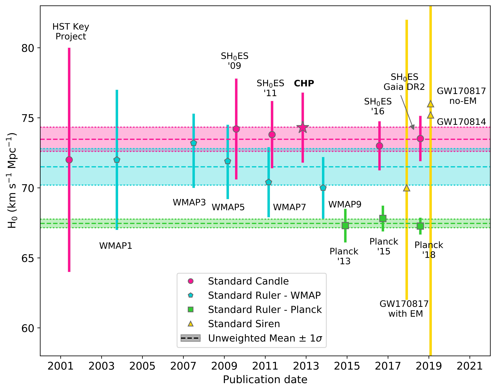
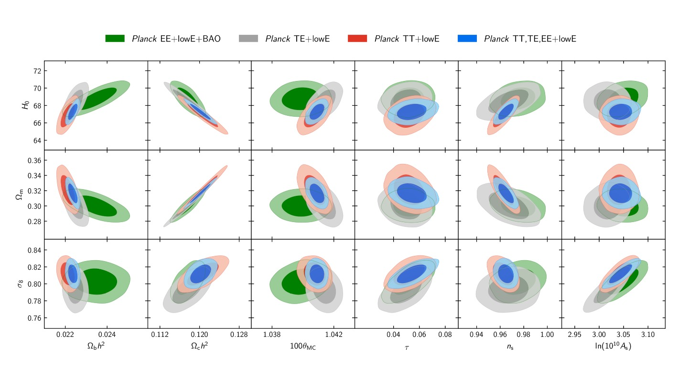
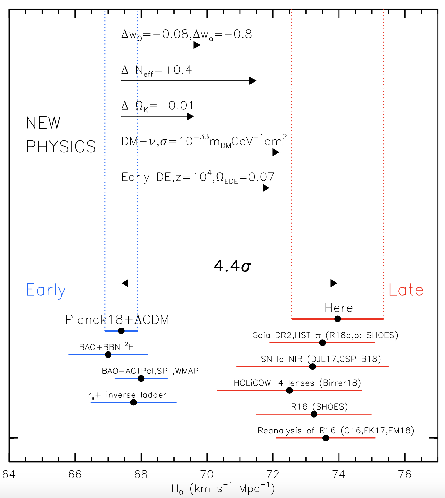

Current Research {#ch:current-research}
===================================

In this section we will look at the current research that is being undertaken to measure the Hubble constant, $H_0$. The papers summarised are the ones you discussed in the session on 29th April. The slides that you completed during that session are available [here](https://docs.google.com/presentation/d/1Fm6MwLAYCCIP8NlJTsHChE9qB3rJ1j02yhqopixgYNA/edit?usp=sharing). 

Independent $H_0$ measurements {#sec:independent-ho}
-----------------

In the discussion session you looked at one of three papers:

1. @Riess-2021: Cosmic Distances Calibrated to 1% Precision with *Gaia* EDR3 Parallaxes and Hubble Space Telescope Photometry of 75 Milky Way Cepheids Confirm Tension with $\Lambda$CDM.
2. @Ligo2017: A gravitational-wave standard siren measurement of the Hubble constant.
3. @DES2018: Dark Energy Survey Year 1 results: A precise $H_0$ estimate from DES Y1, BAO, and D/H data.

These three papers each use a different technique to estimate $H_0$, each constraining the cosmological parameters in different ways and producing different results. Table \@ref(tab:papers) compares the three experiments.

Table: (\#tab:papers) Summary of the three papers considered in this section.

| Paper | Technique     | $H_0$ estimate <br /> $\left(\text{ km s}^{-1} \text{ Mpc}^{-1}\right)$| 
|:----------|:----------|----------:|
| @Riess-2021 | Standard candle | $73.2 \pm 1.3$|
| @Ligo2017 | Standard siren | $70.0 ^{+12.0}_{-8.0}$|
| @DES2018 | Standard ruler | $67.4 ^{+1.1}_{-1.2}$|

### Paper 1 - standard candle {#sec:paper1}

@Riess-2021 used observations of Cepheids from *Gaia* to improve the standard candle measurement of $H_0$. Previous Cepheid-based standard candle experiments had been limited by the small number of Cepheids with both high-precision parallaxes and high-precision photometry. The team overcame this by combining *Gaia* parallaxes with a new observational technique to measure the apparent magnitudes of Cepheids that had previously been too bright to be observed with the *Hubble Space Telescope*. Bright objects are a problem as when too many photons hit the same pixel on a detector the pixel will "saturate". This means that the magnitude measurements will be incorrect, as the value recorded by the pixel will no longer reflect the true value of incident photons. Their "spatial scanning" technique circumvents this problem by letting the target star "drift" across the field of view of the camera, spreading the incident photons over a much larger number of pixels and preventing saturation. 

The team used their larger sample of Cepheids to calibrate the Cepehid Leavitt Law (see Sec \@ref(sec:standard-candle-h0)), and propogated this distance calibration up the distance ladder to a sample of Type Ia supernova published in their previous papers (@Riess2018). Their new calibration resulted in a slightly lower value of $H_0$ and a reduction in their reported uncertainty. 

### Paper 2 - standard siren {#sec:paper2}

@Ligo2017 used observations of the gravitational wave event GW170817 and its electromagnetic counterpart, the gamma-ray burst GRB170817A) to find a **standard siren** measurement of $H_0$. Standard sirens work in a similar way to standard candles, but instead of considering the luminosity of light coming from the source, we're using the gravitational waves.

We can't just look at any old object to get a standard siren measurement. We need to observe a binary system just as the components are inspiralling so we can see the gravitational wave signal. Using this gravitational wave signal, known as a "chirp", we can find a model describing the masses of the binary objects that best fits the observed signal. Knowing the masses gives us the amount of energy emitted in gravitational waves. By comparing this to the gravitational waves observed on Earth, and assuming that general relativity holds, we can calculate the distance to the event, much like we would do by comparing the absolute and apparent magnitudes of a Cepheid.

In order to measure the Hubble constant from gravitational waves, we also need the redshift of the system as 
\begin{equation}
H_0 = \dfrac{v}{D}
(\#eq:ho-red)
\end{equation}
and we need the redshift, $z$ to get the recession velocity $v$.

The gravitational wave signal from GW170817 discussed in @Ligo2017 was localised to the galaxy NGC 4993. As the event coincided with this galaxy, the redshift of the galaxy could be used to determine the recession velocity, and the Hubble constant could be estimated.


### Paper 3 - standard ruler {#sec:paper3}

@DES2018 used data from the first year of the Dark Energy Survey to find a standard ruler estimate of $H_0$ using weak lensing and baryon acoustic oscillations (BAO). The BAO signal is seen as a peak in the galaxy correlation function, which measures the distances between galaxies, similar way to peaks in the CMB. Acoustic waves in the early universe travelled freely until the time of decoupling, when the density fluctuations were "frozen". These over-dense regions became the seeds of galaxy formation, leading to the peak in the correlation function at the sound horizon, $r_s$. The apparent size of the size horizon is compared to its predicted size from a given cosmological model, allowing the parameters of the model to be constrained. 

@DES2018 quoted two values for $H_0$ in their paper. The first (given in Table \@ref(tab:papers)) used only the DES results. The second combined the DES results with several other experiments, resulting in a slightly higher value of $H_0 = 69.3 ^{+0.4}_{-0.6} \text{ km s}^{-1} \text{ Mpc}^{-1}$. 


The $H_0$ tension {#sec:ho-tension}
-----------------

The values of $H_0$ from the three papers are all different. But just how different are they?

Figure \@ref(fig:ho-tension) shows a selection of $H_0$ measurements taken since 2001 using a selection of techniques. Pink circles indicate standard candle measurements; blue hexagons indicate standard ruler measurements from the *WMAP* experiment; green squares indicate results from *Planck*; yellow triangles indicate standard siren measurements from gravitational waves. The pink star is the result from the Carnegie Hubble Program [@CHP2012], which was the project I worked on measuring $H_0$ using mid-infra-red observations of Cepheids. The dashed lines represent the (unweighted) mean values of $H_0$ from each technique, with the shaded regions representing the 1$\sigma$ uncertainty on that value. 

```{r echo=FALSE, ho-tension, out.width='100%', fig.show='hold', fig.cap="Measurements of $H_0$ from different experiments published since 2001. Pink circles indicate standard candle measurements; blue hexagons indicate standard ruler measurements from the *WMAP* experiment; green squares indicate results from *Planck*; yellow triangles indicate standard siren measurements from gravitational waves."}

```

The first thing you may notice is that the standard candle mean (pink) agrees with the *WMAP* measurements (blue). But what do we mean by 'agrees with' in this context? We can say that measurements agree statistically if they are the same within their associated uncertainties. In this case, the standard candle average is $H_{0, \text{SC}}$ = 73.5 $\pm$ 0.9 km s$^{-1}$ Mpc$^{-1}$ and the *WMAP* average is $H_{0, \text{W}}$ = 71.5 $\pm$ 1.3 km s$^{-1}$ Mpc$^{-1}$. The difference between these values, $\Delta H_0$, is 
\begin{align}
\Delta H_0 &= H_{0, \text{SC}} - H_{0, \text{W}} \\
\Delta H_0 &= 73.5 - 71.5\\
\Delta H_0 &= 2.0 \text{ km s}^{-1} \text{ Mpc}^{-1}
    (\#eq:delta-ho)
\end{align}

The uncertainty on $\Delta H_0$, $\sigma_{\Delta}$, is found by summing the uncertainties in quadrature:
\begin{align}
\sigma_{\Delta} &= \sqrt{\sigma_C^2 + \sigma_W^2} \\
\sigma_{\Delta} &= \sqrt{0.9^2 + 1.3^2}\\
\sigma_{\Delta} &= 1.6 \text{ km s}^{-1} \text{ Mpc}^{-1}
    (\#eq:delta-ho-2)
\end{align}

So the two values differ by 1.25$\sigma_{\Delta}$. Is this a real difference?

Gaussian Uncertainties {#sec:gaussian-unc}
--------------

We assume that the uncertainties follow a **Gaussian distribution**. For a Gaussian distribution, the probability of measuring a value $x$ when the true value is $\langle x \rangle$ with an uncertainty $\sigma$ is shown in Figure \@ref(fig:gaussian). 

```{r echo=FALSE, gaussian, out.width='100%', fig.show='hold', fig.cap="Gaussian uncertainties. If we measure a value $x$ for a variable that has a true value $\\langle x \\rangle$ and uncertainty $\\sigma$, there is a 68.3% probability that $x$ will be within $\\langle x \\rangle \\pm 1\\sigma$. There's a 95.4% probability of $x$ being within $\\langle x \\rangle \\pm 2\\sigma$, and 99.7% of $x$ being within  $\\langle x \\rangle \\pm 3\\sigma$."}
knitr::include_graphics("Images/normal-curve.png")
```

We can see from Fig. \@ref(fig:gaussian) that (statistically speaking) it's quite likely for us to measure a value that is 1.25$\sigma$ away from the "true" value. There's approximately a 21% chance of measuring a difference greater than $\pm$ 1.25 $\sigma$. **Note:** If you want to calculate the probability of measuring a give $\sigma$ deviation you can use a statistical table, such as [this one](https://en.wikipedia.org/wiki/Standard_normal_table#Cumulative_from_mean_(0_to_Z)).

So when is the difference significant? When would we say that the values don't agree? It's common in astronomy to use 3$\sigma$ as the limit for statistical significance. As Fig. \@ref(fig:gaussian) shows, there's only a 0.3% chance of a measurement that is more than 3$\sigma$ away from the mean occurring by chance. So we say that a measurement is consistent if it is within 3$\sigma$ of the expected value, and discrepant if if lies further away than 3$\sigma$.

We can now go back to Fig. \@ref(fig:ho-tension). We've shown that the standard candle and *WMAP* measurements are in agreement, but can we say the same about the *Planck* measurements? The mean of the *Planck* values is $H_{0, \text{P}}$ = 67.5 $\pm$ 0.3 km s$^{-1}$ Mpc$^{-1}$, lower than both the previous values and with a smaller uncertainty. Doing the same calculations as in Eqs. \@ref(eq:delta-ho) and \@ref(eq:delta-ho-2), we find that the measurements differ by $\Delta$ = 6.0 $\pm$ 1.0 km s$^{-1}$ Mpc$^{-1}$, corresponding to a 6$\sigma$ difference! The probability of this occurring by chance is approximately $10^{-9}$. It's extremely unlikely that a difference of this size is due to a statistical fluctuation and the measurements are **not** consistent. 

We can do the same analysis for the results in the papers we looked at. The @Riess-2021 and @DES2018 results are not consistent. This is strange - surely both experiments should give the same result? This difference is known as the **Hubble tension** (or $H_0$ tension). The Hubble tension is one of the big open questions in Cosmology at the moment. Recall Fig. \@ref(fig:ho-distance-ladder) in Sec. \@ref(sec:ho-distance-ladder), which showed $H_0$ measurements taken since 1930. The early measurements were very far from our current measurements, but the values came into agreement, reaching consensus around 2000. That agreement existed until the first results from *Planck* in 2013, and the disagreement between *Planck* and standard candle experiments has increased as the uncertainties on all experiments have improved. 

Ideally we would have a third independent measurement to use as a tie-breaker. The @Ligo2017 result would be the ideal candidate for this as it's independent of the other results. However, its uncertainty is big -- about 10 times bigger than the uncertainties on the more traditional measurements. If we did the same calculations as before to see whether it was consistent with previous results, we'd find it agreed with everything. This isn't particularly useful for breaking the tie between our experiments. 

However, this measurement was from **just one object**. Distance ladder measurements of $H_0$ use large samples of supernovae; this is the equivalent of measuring $H_0$ from a single supernova. So as we increase the sample size of standard sirens, our uncertainty on $H_0$ should decrease, with the statistical uncertainty decreasing approximately proportionally to $\sqrt{N}$, where $N$ is the number of objects. But right now, we can't use standard sirens to break the Hubble tension. 

## Combining independent measurements {#sec:combining-mes}

In Chapters \@ref(ch:obs-techs) and \@ref(ch:obs-techs-cmb) we looked at how the distance ladder and the cosmic microwave background could provide estimates of $H_0$. However, these two techniques are not the only ways we can find $H_0$. In fact, it is useful to combine different techniques, as each will constrain the parameters in the cosmological model in different ways.

Figure \@ref(fig:planck-corr) shows how different parameters are constrained by the *Planck* experiment. 

```{r echo=FALSE, planck-corr, out.width='100%', fig.show='hold', fig.cap="Results from @Planck18. The different coloured ellipses represent different analyses of the data. Grey, red, and blue represent the results using only *Planck* data, with green ellipses combining the *Planck* data with results from Baryon Acoustic Oscillations (BAO) experiments."}

```

In Fig. \@ref(fig:planck-corr), the grey, red, and blue ellipses show the constraints on each parameter when *only* the *Planck* data is used. The green ellipses show the constraints from including data from a **baryon acoustic oscillations** (BAO) experiment in the model. Looking at the top left panel of Fig. \@ref(fig:planck-corr), which shows the constraints on $H_0$ and $\Omega_{b}h^2$, we can see that including the BAO data has a significant effect on the values of $H_0$ and $\Omega_{b}h^2$. For other panels, for example $\sigma_8$ vs $\Omega_{c}h^2$ (bottom row, second panel from the left), we can see that including the BAO data doesn't have much of an effect.

Another interesting comparison to make is between the *Planck* and distance ladder results. Figure \@ref(fig:planck-shoes) shows the constraints on $H_0$ and $\Omega_m$ from *Planck*, BAO experiments, and the SH$_0$ES experiment [@Riess2018]. While *Planck* and BAO put joint constraints on $\Omega_m$ and $H_0$, SH$_0$ES *only* constrains $H_0$. The difference is that the SH$_0$ES value for $H_0$ is direct -- it does not depend on the other parameters in the cosmological model. 

```{r echo=FALSE, planck-shoes, out.width='80%', fig.show='hold', fig.cap="Constraints on $H_0$ and $\\Omega_m$ from *Planck* (blue ellipses), BAO experiments (green and grey ellipses), *Planck* and BAO combined (red ellipses), and the distance ladder results from @Riess2018 (grey bar). Figure fromfrom @Planck18. "}
knitr::include_graphics("Images/planck-ho-dl.png")
```

## Possible explanations for the Hubble tension {#sec:resolving-tension}

The possible explanations for the Hubble tension fall into two distinct categories:

1. Experimental error 
2. New physics

Experimental error could come from a number of sources. There could be an error in the standard candle analysis, in the standard ruler analysis, or in both. All the different groups working on these experiments have tried to quantify the uncertainties in their experiments as completely as possible, but it is possible that there are biases or other sources of uncertainty that haven't been taken into account. Underestimation of the uncertainties would make the difference seem larger than it really is. 

New physics is the more exciting answer to the Hubble tension. Is there something else that we should be including in the cosmological model that we've missed out? However, we can't justify adding new physics until we've investigated the possibilities of experimental error. 

We've already looked at one way to address the experimental error aspect; using a new, completely independent experiment to measure $H_0$. This is where the yellow points on Fig \@ref(fig:ho-tension) come in. However, as we've seen above, we don't have enough data on gravitational waves yet to break the tie between standard candles and standard rulers. 

Other possibilities for exploring the experimental error possibility include:

 - Replacing Cepheids in the distance ladder with a different standard candle
 - Improving the parallax calibration of the distance ladder
 - Increasing the sample size of supernovae by looking at different types of host galaxies
 - Making independent measurements of the CMB with experiments other than *Planck*, such as the South Pole Telescope.
 
 The above list is not complete, and there are many other ways we can test our results from standard candles and standard rulers. 
 
 
New Physics? {#sec:new-phys}
--------------------
 
 If we can rule out experimental error as the source of the Hubble tension, then we could be seeing the effects of "new physics" that hasn't been included in the $\Lambda$CDM model. As the standard candle $H_0$ measurements are independent of the $\Lambda$CDM model they will not change. We'll be looking for changes to existing parameters, or additional parameters, in $\Lambda$CDM that drive the *Planck* measurements upwards to agree with other results.
 
Figure \@ref(fig:riess19-fig4) shows how the standard candle result from @Riess2019 (red point, labelled "Here") compares to other standard candle results (other red points) and standard ruler results (blue points). @Riess2019 used an improved calibration of the distance ladder, using eclipsing binary systems in the Large Magellanic Cloud to calibrate the Leavitt law. Using this new calibration they found $H_0 = 74.03 \pm 1.42$ km s$^{-1}$ Mpc$^{-1}$. This is still higher than the *Planck* measurement, and the reduced uncertainty compared to previous standard candle measurements means the difference is now statistically significant at 4.4$\sigma$. 

```{r echo=FALSE, riess19-fig4, out.width='80%', fig.show='hold', fig.cap="The 4.4$\\sigma$ difference between local measurements of $H_0$ and the value predicted from Planck+$\\Lambda$CDM. Possible physics causes for a 2%–4% change in $H_0$ include time-dependent dark energy or nonzero curvature, while a larger 5%– 8% difference may come from dark matter interaction, early dark energy or additional relativistic particles. From @Riess2019."}

```

The horizontal arrows from the 'NEW PHYSICS' section of Fig. \@ref(fig:riess19-fig4) show how changes to $\Lambda$CDM would affect the *Planck* result, bringing it into agreement with @Riess2019. For example, removing the assumption that we live in a flat ($k=0$) Universe and allowing $k$ (hence $\Omega_k$) to be a free parameter in the model increases the *Planck* $H_0$ value making the difference statistically insignificant. Changing $w$, which parameterises the dark energy equation of state, has a similar effect. Dark energy could have also had non-negligible effect on the Universe at early times. 

While some of the changes to $\Lambda$CDM may have little immediate effect on life on Earth and physics in general, some of the proposed changes are more fundamental. Changing the number of relativistic particles, $N_{\text{eff}}$ in $\Lambda$CDM by 0.4 -- i.e. increasing the number of neutrinos or increasing the masses of existing neutrinos -- can bring the $H_0$ measurements into agreement. But now we're messing with the standard model of particle physics, not just cosmology! Can we do that? Maybe. Another suggestion is that dark matter could interact with relativistic particles (such as neutrinos). Again, this is changing a part of physics that we thought was well understood!

All of these extensions and changes to $\Lambda$CDM are speculation right now and have not been proven. However, they highlight the importance of resolving the Hubble tension one way or another. If we can resolve the tension with independent measurements or with improvements to existing experiments, then we don't need to add new physics to $\Lambda$CDM. If this doesn't happen, and our uncertainties keep dropping and the tension keeps increasing, changes to $\Lambda$CDM and/or other branches of fundamental physics will need to be seriously considered.


